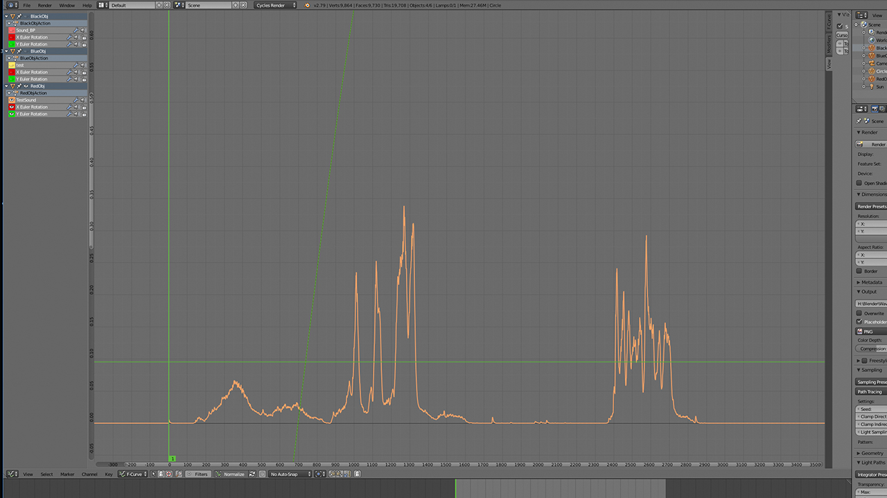

# University Work

##### 2017

## Physics of Sound 
------
###### (TFYA65 Ljudfysik)

### Project
The goal of the project was to do a frequency analysis on a given signal (an audio file), filter according to certain specifications and make 3D animations using the signal. In this case, a low pass and high pass were used to create three audio files in three different frequency ranges. The audio files were then imported into Blender to create an animation to change the objects' properties. The report is available [here](https://drive.google.com/file/d/1vX2lT6q238dQaXUPzaimQc0Zx2j_lgCs/view?usp=sharing) (in Swedish).

<iframe width="560" height="315" src="https://drive.google.com/file/d/1RJb9Op4w3_FRs3ezDJTgs7nv7S_n7Bk0/preview" frameborder="0" allow="accelerometer; autoplay; clipboard-write; encrypted-media; gyroscope; picture-in-picture" allowfullscreen></iframe>

High pass of the signal 

Low pass of the signal 

